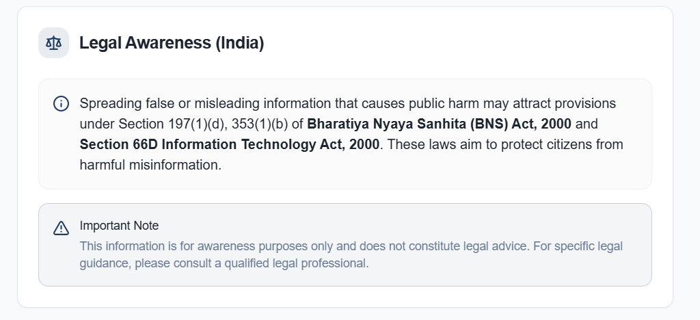

# SanketAI 🛡️  
**AI-Powered Fake News Detection & Responsible Reporting System**

SanketAI is a full-stack web application designed to combat the growing problem of misinformation and fake news. Instead of claiming to verify absolute truth, SanketAI focuses on **detecting potentially misleading content**, raising awareness, and **guiding users towards responsible action** such as verification and reporting through official channels.

Fake news today plays a critical role in influencing public opinion, disrupting social harmony, spreading panic, and even impacting democratic processes like elections. SanketAI aims to act as an **early warning system** that encourages users to think before they share.

---

## 🚀 Project Objectives

- Detect potentially fake or misleading news using AI  
- Provide confidence-based credibility assessment  
- Educate users on responsible actions  
- Direct users to official reporting platforms  
- Promote digital literacy and misinformation awareness  

---

## 🧠 Core Idea

SanketAI does **not browse the internet or verify facts in real time**.  
Instead, it uses **zero-shot classification** to analyze the *linguistic credibility* of the provided text and classify it into:

- **This news is factually accurate and supported by reliable evidence.**
- **This news is misleading, exaggerated, or lacks proper evidence.**
- **This news is completely fabricated or false.**

This approach is lightweight, scalable, and effective for identifying viral misinformation patterns such as sensational language, unverified claims, and misleading phrasing.

---

## 🧩 Technology Stack

### Frontend
- React  
- TypeScript  
- Tailwind CSS  
- Modern component-based UI architecture  

### Backend
- Spring Boot  
- RESTful API design  
- Layered architecture (Controller → Service → Client → DTO)

### AI / NLP
- Hugging Face Inference API  
- Zero-Shot Classification  
- Model: `facebook/bart-large-mnli`

---

## 🤖 AI & Zero-Shot Classification

SanketAI uses **zero-shot classification**, which allows the system to classify text into custom categories *without training on labeled data*.

### How it works:
1. User submits news text
2. Backend sends text + labels (`fake`, `misleading`, `real`) to the AI model
3. Model evaluates how strongly the text supports each label
4. Confidence scores are returned
5. The highest-confidence label is selected and mapped to a verdict

This enables flexible classification without datasets or retraining.

---

## 🔁 Application Flow

1. User enters a news article or claim
2. Frontend sends request to backend API
3. Backend calls Hugging Face AI service
4. AI returns label-confidence pairs
5. Backend selects the strongest label
6. Verdict, confidence, and guidance are returned
7. Frontend displays results and actions

---

## 🖥️ User Interface Overview

### Home Page  
📌 **  
**Image name:** `home.png`

- Clean and modern UI  
- News input area  
- “Verify News” action button  

---

### Analysis Result View  
📌 **   
**Image name:** `result_card.png`

- Verdict displayed with confidence score  
- Clear visual distinction between outcomes  

---

### Guidance & Awareness Section  
📌 **   
**Image name:** `guidance.png`

- Practical advice on what to do next  
- Encourages responsible behavior  

---

### Legal Awareness Section  
📌 ***  *  
**Image name:** `legal_awareness.png`

- Highlights consequences of spreading misinformation  
- References Indian legal provisions (BNS & IT laws)  
- Awareness-only, not legal advice  

---

### Reporting Section  
📌 ***  *  
**Image name:** `reporting.png`

- Direct links to:
  - Cybercrime Portal  
  - PIB Fact Check  
  - Other reporting links/contacts

---

## 🧪 Test Coverage Overview

The project includes both **positive and negative test scenarios**, such as:

- Valid fake news input  
- Valid real news input  
- Empty or short input  
- Backend downtime  
- AI service errors  
- Random or non-news text  

This ensures robustness and graceful error handling.

---

## ⚠️ Limitations

- Does not browse live internet sources  
- Does not guarantee factual correctness  
- AI decisions are probability-based  
- Depends on language patterns rather than real-time verification  

These limitations are intentionally acknowledged to promote responsible AI usage.

---

## 🔮 Future Enhancements

- Integration with live news APIs  
- Retrieval-Augmented Generation (RAG)  
- Multilingual support  
- User history and analytics  
- Browser extension for social media platforms  

---

## 🎯 Key Learnings

- Full-stack system design  
- Spring Boot layered architecture  
- External AI API integration  
- Zero-shot NLP classification  
- Defensive error handling  
- Responsible AI principles  

---

## 📌 Conclusion

SanketAI is not just a technical project — it is an **awareness-driven system** that highlights how technology can be used responsibly to combat misinformation.

By combining modern web technologies with AI, SanketAI demonstrates a practical approach to solving a real-world problem while maintaining ethical boundaries.

---

**Always verify before you share.**
